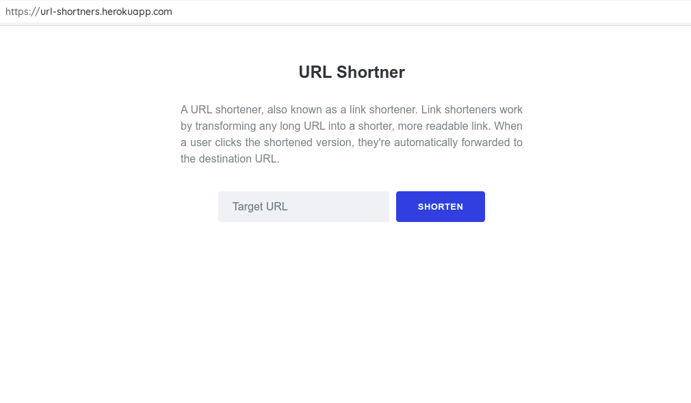
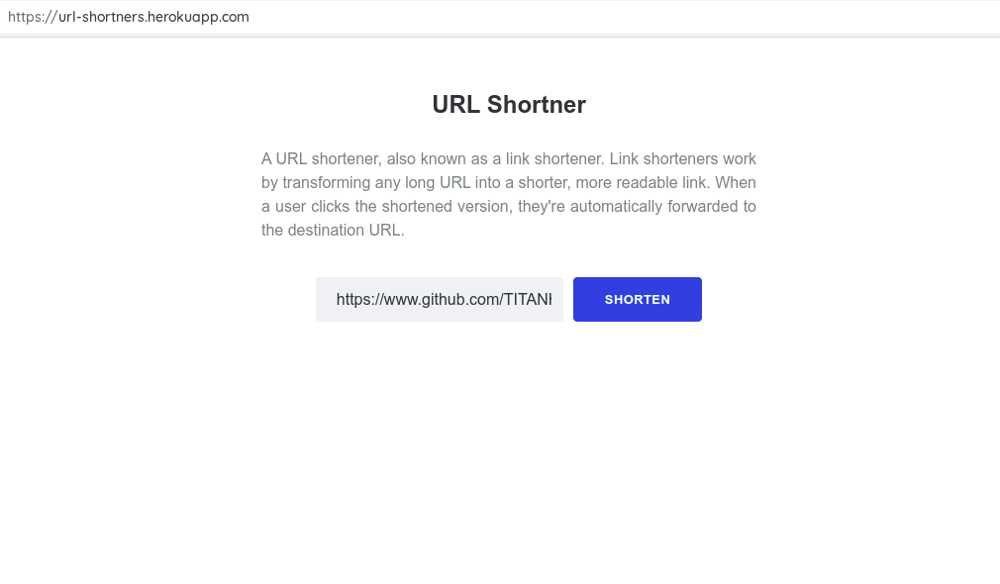
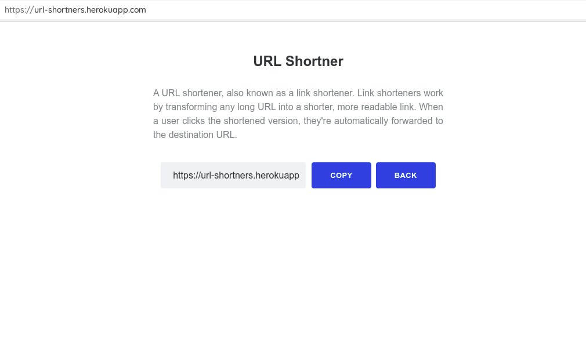
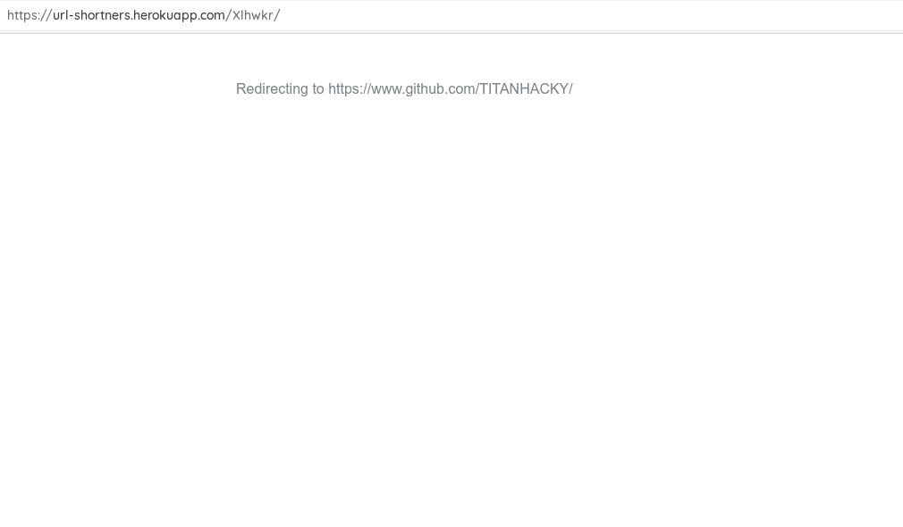

# URL SHORTNER

A URL shortener, also known as a link shortener. Link shorteners work by transforming any long URL into a shorter, more readable link. When a user clicks the shortened version, they're automatically forwarded to the destination URL.

##Demo
The app is hosted in Heroku -> [Live Demo](https://url-shortners.herokuapp.com/)

<video src="./media/url-shorterners.webm"></video>

##Screenshots







## **Download**

```
$ git clone https://github.com/TITANHACKY/url-shortner.git
```

## **Dependencies**
- python 3
- django
- djangorestframework

## **Setup**

```
#  navigate to project 
$ cd url-shortener

# install dependencies
$ pip3 install --r requirements.txt

$ python3 manage.py makemigrations

$ python3 manage.py migrate

$ python3 manage.py runserver
```

Watching for file changes with StatReloader
<br>Performing system checks...

System check identified no issues (0 silenced)<br>
Django version 4.0.6, using settings 'UrlShortner.settings'.<br>
Starting development server at http://127.0.0.1:8000/
Quit the server with CONTROL-C.


####Now Start Using Url Shortner By Clicking the link http://127.0.0.1:8000/